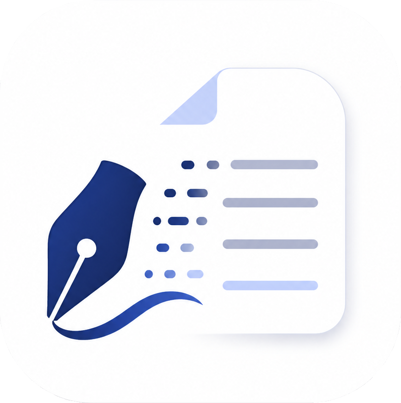
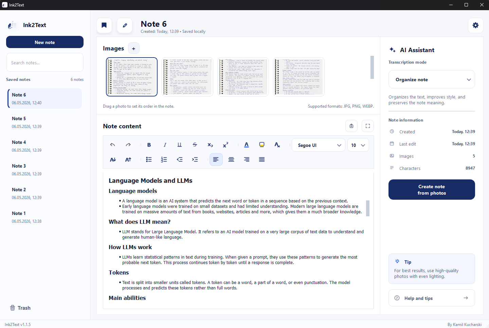
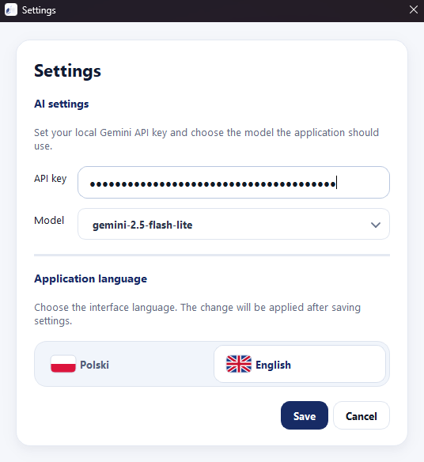
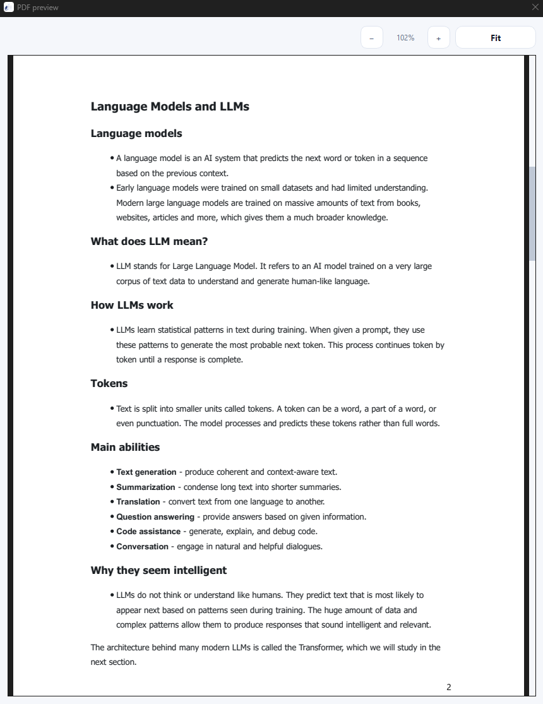

<p align="center">
  
</p>

<h1 align="center">Ink2Text</h1>

<p align="center">
  A modern desktop app for turning handwritten notes from photos into clean, editable, beautifully formatted text.
</p>

<p align="center">
  
  
  
  
</p>

<p align="center">
  <a href="README.pl.md">Polska wersja README</a>
</p>

---

## Preview

<p align="center">
  
  <br>
  <sub>Main workspace for importing photos, generating notes, editing text, and managing local notes.</sub>
</p>

<p align="center">
  
  <br>
  <sub>AI settings for configuring the Gemini API key, model, and app language.</sub>
</p>

<p align="center">
  
  <br>
  <sub>PDF preview for checking the final document before export.</sub>
</p>

<br>

## Download

A ready-to-use Windows executable is available in the **Releases** section.

> Note: Windows SmartScreen may show a warning because the application is not digitally signed.

<br>

## About The Project

Ink2Text is a desktop productivity app that helps you convert handwritten notes into readable digital notes. You import one or more photos, choose an AI transcription mode, generate a note, edit it in a rich text editor, and export the final result to PDF.

This project was built as a complete desktop application focused on a real user workflow: importing handwritten material, processing it with AI, editing the result, storing notes locally, and exporting a polished PDF.

<br>

## Why I Built It

Handwritten notes are still useful, fast, and natural, but they are difficult to search, edit, and share. Ink2Text was created to bridge that gap: keep the convenience of writing by hand, then turn the result into a structured digital document when needed.

<br>

## Highlights

- Import one or many photos of handwritten notes.
- Reorder photos with drag and drop.
- Generate editable notes using Gemini AI.
- Choose between faithful transcription, formatting, cleanup, and note expansion modes.
- Keep the note language consistent with the original photo.
- Edit generated content in a rich text editor.
- Preview and export notes as polished PDF files.
- Store notes locally on your computer.
- Use a clean, modern desktop interface.
- Build a standalone Windows `.exe`.

<br>

## AI Modes

| Mode | Purpose |
| --- | --- |
| Faithful transcription | Rewrites the text from the photo without improving or reformatting it. |
| Note formatting | Adds structure, headings, spacing, and readable formatting while keeping the original content. |
| Note cleanup | Improves style, grammar, endings, and readability while preserving the meaning. |
| Note expansion | Improves the note and may add useful explanations, limited to a controlled amount of extra content. |

<br>

## Tech Stack

| Area | Technology |
| --- | --- |
| Language | Python 3.12 |
| Desktop UI | PySide6 / Qt |
| AI provider | Google Gemini |
| Image handling | Pillow |
| PDF export | Qt rich text rendering |
| Packaging | PyInstaller |
| Tests | pytest |

<br>

## What I Learned

Ink2Text was a good exercise in building a desktop app as a complete product, not just a technical demo. The most valuable parts were:

- Designing an AI workflow that feels reliable for the user: structured prompts, source-language preservation, retries, model fallback, API key handling, and readable error messages.
- Writing object-oriented Python code in a more structured and maintainable way.
- Splitting a Python codebase into clear layers: UI components, services, storage, models, configuration, and build scripts.
- Working with PySide6 beyond basic widgets by creating custom UI elements, shared styling, localized text, and behavior that stays consistent on Linux and Windows.
- Keeping the app local-first, with notes, settings, and sensitive configuration stored on the user's machine instead of depending on an external backend.

<br>

## Getting Started

### 1. Clone the repository

```bash
git clone https://github.com/kamil-kucharski/Ink2Text.git
cd Ink2Text
```

### 2. Create and activate a virtual environment

Linux / macOS:

```bash
python3 -m venv .venv
source .venv/bin/activate
```

Windows PowerShell:

```powershell
python -m venv .venv
.\.venv\Scripts\activate
```

### 3. Install dependencies

```bash
pip install -e ".[dev,build]"
```

### 4. Run the app

```bash
python -m app
```

<br>

## Gemini API Key

Ink2Text uses Gemini for AI note generation. On first launch, the app will ask you to configure your Gemini API key in the settings/onboarding flow.

You can get a Gemini API key from Google AI Studio:

```text
https://aistudio.google.com/app/apikey
```

<br>

## Sample Notes

The repository includes a `sample_notes/` folder with example handwritten notes that can be used for testing the app after running it from source.

You can open the app, import the sample images, choose an AI mode, and generate a note without preparing your own photos first.

<br>

## Build Windows EXE

On Windows, after installing dependencies, run:

```powershell
python scripts\build_windows_exe.py
```

The generated application will be available in:

```text
dist\Ink2Text\Ink2Text.exe
```

<br>

## Run Tests

```bash
pytest
```

<br>

## Project Structure

```text
app/
  services/        AI provider, PDF export, image preparation
  storage/         Local note persistence
  ui/              PySide6 interface and reusable UI components
  models/          Note data model
assets/            App icons and visual assets
sample_notes/      Example notes for testing
scripts/           Build scripts
tests/             Unit and integration tests
```

<br>

## Privacy

Ink2Text stores notes and settings locally. Photos and note content are only sent to the configured AI provider when you explicitly generate a note.

<br>

## Author

Created by **Kamil Kucharski**.
